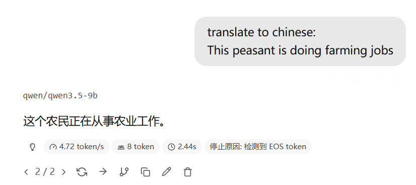
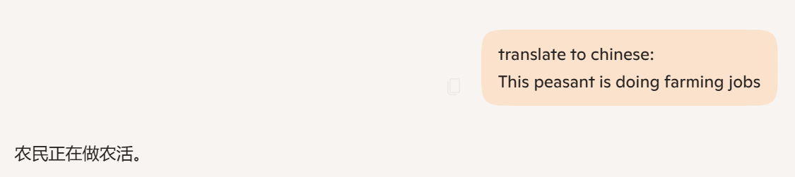

### HKUST_CSIT5520NLP_Translation_ContextInjectionEnhancement

#### Full Problem Solving Process / 问题的完整解决过程

##### Rely on

1. https://github.com/kreuzberg-dev/html-to-markdown for convert the HTML to this readMe file.
2. opencc (pip package) for converting the AI accidentally generated traditional Chinese to simplified Chinese, to standardize the data.
3. sentence_transformers + torch (pip package) for calculating the similarity between the response with the instruction and the response without the instruction, to verify whether the response is related to the instruction. (Tried, but not AI cannot be both the judge and the player, so this method is not used in the final analysis. The judgement of whether the response is related to the instruction is done by human. The similarity and information is using traditional algorithm.)
4. jieba (pip package) is for cutting the Chinese sentence into words, used for calculating the unique word count for the response in Chinese.
5. pyyaml (pip package) is for reading the input from the YAML file, which is used for generating the input for the AI.
6. Python, R and ggplot2 (R package) is for analyzing the result and drawing the graph for the result.
7. lmstudio for generating the response from the AI. (For easy testing)
8. lmstudio (pip package) for generating the response from the AI, which is used for generating the response from the AI.
9. aiofiles (pip package) for reading and writing the files asynchronously, which is used for generating the response from the AI and storing the response in the output folder.
10. textdistance (pip package) for calculating the similarity between the response with the instruction and the response without the instruction, to verify the increase of information, lower the similarity, means more information is generated. (This is using traditional method to verify the increase of information, so it is ok for validation.)

##### 依赖

1. https://github.com/kreuzberg-dev/html-to-markdown 用于将HTML转换为这个ReadMe文件。
2. opencc（pip包）用于将AI偶尔生成的繁体中文转换为简体中文，以标准化数据。
3. sentence_transformers + torch（pip包）用于计算带有指令的回答与不带指令的回答之间的相似度，以验证回答是否与指令相关。（尝试过，但AI不能既当裁判又当运动员，所以这个方法没有被用于最终分析。是否与指令相关的判断由人来完成，相似度和信息使用传统算法。）
4. jieba（pip包）用于将中文句子切分成词，用于计算中文回答的独特词汇数量。
5. pyyaml（pip包）用于从YAML文件中读取输入，用于生成AI的输入。
6. Python, R和ggplot2（R包）用于分析结果并绘制结果的图表。
7. lmstudio用于生成AI的回答。（为了方便测试）
8. lmstudio（pip包）用于生成AI的回答，用于生成AI的回答。
9. aiofiles（pip包）用于异步读取和写入文件，用于生成AI的回答并将回答存储在输出文件夹中。
10. textdistance（pip包）用于计算带有指令的回答与不带指令的回答之间的相似度，以验证信息的增加，较低的相似度意味着生成了更多的信息。（这是使用传统方法来验证信息的增加，所以对于验证来说是可以的。）
11. **The Base of AI / AI 的本质**

- Based on the Matrix calculation;
- these matrixes combines together;
- mixes in the non-Linear activation function;

Because of "Economic base determines the superstructure", 
 this is the base of AI.

---

- 基于矩阵运算
- 这些矩阵层层叠加在一起
- 混合了非线性函数（黑话叫激活函数）

因为"经济基础决定上层建筑"，所以这是AI的本质。

---

2. **What is the base / 本质是什么** Think about one small matrix with data and get the output:
   Output = Matrix × Data + Bias

- **Matrix** is the weight of the model.
- **Data** is the input data.
- **Output** is the result of the calculation.
- **Bias** is the additional term added to the output.
  (also can be "Embedding" in the context of NLP, as human word as "attribute tag")
- We already have the **Input** and the **Outputexpected**.
- Target of training:
  Adjust the **Matrix** to make the **Output** close to the expected result (**Outputexpected**).

--- 每个小线性层的计算可以表示为：
  输出 = 矩阵 × 数据 + 偏置

- **矩阵** 是模型的权重。
- **数据** 是输入数据。
- **输出** 是计算的结果。
- **偏置** 是加到输出上的额外项 (也可以是自然语言处理中的“嵌入”，人话叫“属性标记”)。
- 我们已经有了 **输入** 和 **输出期望**。
- 训练的目标:
  调整 **矩阵** 使得 **输出** 接近 **输出期望**。

---

3. **Change a view / 换个视角**
   Change the symbols to the one in the textbook;
   which **Input** is x, **Output** is y, **Matrix** is **a**, and **Bias** is b.

---

  换成课本上的符号，**输入** 是 x，**输出** 是 y，**矩阵(变量)** 是 **a**，**偏置** 是 b。

---

It is obvious that this is a linear function.

---

线性函数一眼顶真
  y = ax + b

---

    In the AI model, we have multiple inputs and outputs, which can be represented as a matrix multiplication

    It is just the extension of dimension, from single variable to multi-variable.

---

    在AI中，多个输入和输出，即可表示为矩阵乘法

    仅仅是维度多了，单变量成了多变量。

| y₁   |
| ----- |
| y₂   |
| ⋮    |
| yₙ   |
| a₁₁ |
| ---   |
| a₂₁ |
| ⋮    |
| aₘ₁ |
| x₁   |
| ---   |
| x₂   |
| ⋮    |
| xₙ   |

- y1 = a11×x1 + a12×x2 + ⋯ + a1n×xn
- y2 = a21×x1 + a22×x2 + ⋯ + a2n×xn
- ⋮
- ym = am1×x1 + am2×x2 + ⋯ + amn×xn
- y1 = a11 × x1
- y2 = a21 × x1
- ⋮
- ym = am1 × x1

---

4. **Simple AI Properties / AI的简单性质**     The AI model is a kind of function, which is a mapping from the input space to the output space.

   If we combine the **Input** and the **Output** together, we can get a set of data points (x, y).
   (Call it as the **"Data"**)

- The training process is to find a parameter group.
- We are doing Linear/Non-Linear Regression to fit the **"Data"** (Include **Input** and **Output**) to  **y = ax + b** (or the extension of it).

 **The Linear/Non-Linear Regression Do**

1. Prediction (Assume unseen data follows the rule of dataset)
2. Classification (It is above or below the line)

 **∴ AI is doing Classification and Prediction basically.**

---

    AI可被看作是个映射输入和输出的函数

    将输入和输出看作一个整体，我们就得到了一个数据点集合 (x, y)，暂时管他叫**"数据集"**。

- 训练的过程就是寻找一组参数。
- 让线性/非线性回归函数拟合这个**"数据集"**（包含输入和输出）。

**线性/非线性回归其实在做两件事**

1. 预测（假设未见过的数据遵循数据集的规律）
2. 分类（在回归曲线的上方还是下方）

**∴ AI的本质是简单的分类和预测。**   启发：就好像梯度下降是牛顿法，我们也可以用二分法等等去优化参数（人话：解方程，解没有解析解的方程）

---

5. **Found Problem / 发现的问题**     Since AI is doing classification and prediction,
   we are seeking the problem of classification and prediction.

Prediction
*Not tested in this project, but might be a direction*

Classification
Possible problem:

- Accuracy
- Recursion Depth (How many levels of classification we can do)         Classification has recursive problem.
  There are categories under categories.
- ∵ Time limit of this project.
- ∴ Consider a easy possible problem.
- ∵ And inspired from translation problem,
- and this class is about NLP.
- ∴ We are trying to find out whether there is Recursive depth problem in the translation task.

---

已知AI本质为分类和预测，我们便可在分类和预测中寻找AI的问题。

预测
*没测试过，也没有思考过
但可能是个方向*

分类
可能的问题：

- 准确率
- 递归深度（嵌套分类/多级目录）
- ∵ 时间限制
- ∴ 我们决定做一个相对简单的问题
- ∵ 启发自翻译问题，
- 又∵ 此课程内容为自然语言处理
- ∴ 尝试思考是否有分类递归深度（多层分类）问题

---

    **What kind of problem related to deeper classification in the translation task?**

    **思考：翻译中什么情况涉及多次分类，细分小类？**

    **Answer:** The distinguish of synonym (Words have similar meanings) and polysemy (Words have multiple meanings) in the translation task.

    **答案：** 在翻译中分辨近义词与多义词

    Here, we only test the synonym problem.
The synonyms are always not have the exact same meaning, a lot of them contains extra emotional or cultural, or even context information/omission. While this difference will be enlarged in the translation.

    此处，我们仅针对近义词问题。诸多“同义词”其意思并不完全等同。
这些细微差异往往包含额外的情感、文化，甚至是上下文信息/省略。
而此差异会在翻译中被放大。

    This might be quite important in the task of professional translation. (Culture and context background will influence reader in the understanding and the choice of words in responses.)

    这在专业翻译中或许非常重要（文化和上下文背景会影响读者的理解和反馈用词）

    When we have multiple levels of classification, humans can easily classify the data into a more precise category (Even we do not speak out the detail, but we know that; and this will influence our judgement and choice of future conversation and actions).

    人能非常轻松地将事物更细致的分类（这会影响判断，但有时不会直接说出）

    Here, we try the most typical random example thought out from us; all of the following words has the similar meaning of "Important", but they have different contexts.

    如下随机例子包含中文皆为“重要”的词汇，但含有细微语境差别。

    Note: The true definition and meaning are here are according to the Cambridge Dictionary, and from the Etymology (Word origin) aspect, the concepts are extended from different original meaning.

    注： 此处词汇含义参考剑桥词典及词源学（词义流变）。即如何从原始含义引申出当前概念。

- [Important](https://dictionary.cambridge.org/dictionary/english/important); necessary or of great value or from General/Subjective aspect

对于某人某事有重大价值或者十分被需要（一般/主观角度）

- [Crucial](https://dictionary.cambridge.org/dictionary/english/crucial); Decisive or critical, especially in the success or failure of something

对于某事的成功或失败起决定性作用

- [Vital](https://dictionary.cambridge.org/dictionary/english/vital); Necessary for life (from Life aspect)

如生命般重要，生死攸关，拿掉就崩

- [Significant](https://dictionary.cambridge.org/dictionary/english/significant); important, large, or great, esp. in leading to a different result or to an important change, with reasonable reason (from Meaning aspect)

重要的，重大的，尤其是导致不同结果或重要改变的(不关心成功失败)，且有合理理由的

- [Essential](https://dictionary.cambridge.org/dictionary/english/essential); relating to something's or someone's basic or most important qualities

重要是因为某人/某事具有基本或最重要的特质/质量，或生存必须，长期必要，持续需要

- [Critical](https://dictionary.cambridge.org/dictionary/english/critical); important that saying someone or something is going bad or wrong if not done correctly (Negative aspect)

关键的，如果不正确完成，某人或某事将出问题 （侧重重要因为会导致结果不好）

    Note: the Chinese has one general word "重要" to cover all of the above words. But it does not give out "How/Why" important it is. (
This simple translation is common in the internet, but might not be appropriate in a professional translation scenario.
)

    注：上述英文词汇在中文中皆为“重要”，但通常并不表达出“重要的程度/方式/原因”。（这种翻译简化在网络常见，但私认为在专业翻译中并不合适）

---

**Find:**     In the translate task,
the AI just translate everything into "重要".
The output does not have any decoration or comment with bracket.

---

**发现：**     在翻译任务中，AI把所有词都翻译成了“重要”，且无词汇修饰或者括号注释。

---

    Example (with image):
The word "peasant" has raised meaning. But the AI just translate it into "农民", which is a neutral word for "field/
farmland worker" especially for jobs caring and growing plants, crops and vegetables.

    例子（附图）：
"peasant"有歧视义，但AI把它译成了“农民”。在中文中，这是个中性词，指的是照料和种植植物、农作物和蔬菜的工作。

  Small Model / 小模型

  Large Model / 大模型

---

6. **Possible Solution / 可能的解决方案**     Imagine we have a tree start from the root, if we classified the data into the first layer but not the second layer;
   It doesn't means we do not know the existence of the sub-categories and the relationship. We just stop at the first layer and do not classify further. This is the problem of recursive depth in classification.
   Note: Human will classify the things by small details unconsciously/subliminally. But AI are doing it rigidly like a real machine. It only does what you instructed.

   想象一棵树，从根开始，如果我们只将数据粗分到第一层；你无法判断我们是否知道有第二层，也不能说我们不知道第一层节点和第二层节点之间的关系。即唯一可能为看到了第一层就停止了思考。此为分类深度的问题。
   注：人会在潜意识里通过事物细节分类，但AI非常死板，你说一它就是一，它只会做你设定好的事情。

---

    A Possible Simple solution:If we do not know the relationship of the layer 1 and layer 2, list out the possible sub-categories in the input and point out there will be relationship between them; this will help the AI to recall the possible sub-categories and do a deeper classification.Note: Both 2 things need to be done:

1. List out the possible sub-categories in the input (for comparison and activate the memory of the sub-categories);

Because AI is a classifier (comparer) and predictor, it will do all detail comparison between possible sub-categories and get the difference. (Classification)Although because the current model is mostly based on addition, the ability to enlarge the difference might be a little bit weak compare to the expected, it is enough to show the difference.

1. Point out there will be relationship between them (the instruction for asking the AI to do deeper classification)

Activate/Let Recall + Instruction/Ask for detail jobs (both are necessary)

    一个简单的可能方案：如果我们不知道第一层和第二层的关系，那么列出输入中可能的子类别，并指出它们之间会有关系。这将帮助AI回忆起可能的子类别并进行更细致的分类。注：两件事都需要做：

1. 列出输入中可能的子类别（用于比较和激活子类别的记忆）；

因为AI是个分类器（比较器）和预测器，所以列出所有的子类别能激活AI的分类比较能力，让子类的细节（关系）被比较出来虽然由于现在的模型以加法算法为主，放大差异的能力可能比预计略差，但足够展示差异

1. 指出它们之间会有关系（用于指示AI进行更深入的分类）

激活回忆 + 指示任务 （缺一不可）

---

7. **Aims and Results / 目标与结果**     This project find that the way assigned above is a solution of this kind of problem, and roughly test it in the translation task.

   The result is good, the method works.

   The AI will point out (vital is in life way important in the brackets) the key difference and the extended meaning of the word as expected.

   **with_instruction_with_recall >
   with_instruction_without_recall
   (Information increase,
   but says rubbish when read by human;
   the AI generates a lot of random examples
   which increase the number of unique vocabulary,
   but fails to highlight subtle differences) >
   without_instruction_with_recall >
   without_instruction_without_recall**

   ∴ The correctness of the methodology is also verified by practice.

   Note: You cannot use AI to judge the quality of the response; it is AI becomes both the judge and the player.
   And some things cannot be quantified as said it is a kind of "Academic", but only judged by human.

---

    该项目发现上述方法能有效解决问题。我们在翻译任务中粗略的测试了这个方法，结果很好，方法有效。

    ∴ 经过实践，方法论应该也没大问题

    AI会指出（如：vital为生死攸关）词汇的关键差别和扩展含义，符合预期。

    with_instruction_with_recall >
 with_instruction_without_recall
 (信息增加，但人读起来感觉乱七八糟，
 人判定没有给出想要的额外的信息，
 实际情况是AI自己举了一堆随机的杂七杂八的例子增加了词汇量，
 但是就是点不出来微妙的差异) >
without_instruction_with_recall >
without_instruction_without_recall

    注：绝对不可以图省事或者所谓严谨“学术”用AI来判断回答的质量和信息量，因为这样AI既当了裁判又当了运动员。
而且有的东西无法量化，只能靠人判断。

---

8. **Test Method / 测试方法**     The test method is to measure whether there is extra information generated.

   If there is any information from the second layer, compare to the response only with the first layer information, the amount of information grows.

   Also, the response will be longer compared to the response without the second layer information.

   ∵ AI generated is unstable
   ∴ Use unique word number as a measurement of the amount of information.

∵ Each response has different length
∴ Multi-Dimensional judgement is needed
∴ Unique word count + Response Length + Unique word count per length (Density of information) are all used as measurement.

---

    测试方法是测量是否有额外信息被生成。
如果有第二层的信息，那么与只有第一层信息的回答相比，信息量会增加，且回答的长度也会更长。

    ∵ AI生成的内容不稳定
∴ 使用独特词汇数量作为信息量的衡量标准。

∵ 每个回答的长度不同
∴ 要综合判断
∴ 独特词汇数量 + 回答长度 + 每长度的独特词汇数量（信息密度）都会被纳入参考。

---

9. **File Structure / 文件结构**     The file structure is as follows:

   文件结构如下：

---

1. **README.md**; the main file of this project, which contains the main content and the result of this project.

---

项目介绍文件，包含项目的主要内容，方法，代码和结果。

---

2. **image/**; the folder contains the image used in this project. (Current ReadMe only)

---

静态图片文件夹（目前仅ReadMe中有使用图片）

---

3. **./data/**; the folder contains the data used in this project.

---

数据文件夹
    1. **./dataclass/** are prompt templates in string form in python dataclass.

---

以python dataclass形式存储的字符串格式的提示词模板

---

    2.**./source/** are the replaceable part of the prompt template, which is the input for the AI. (In YAML format) (Remove the comment in your needed, or you can also write your own input in the same format)

---

提示词模板中可替换的部分，即AI的输入（YAML格式）。（根据需要去掉注释，或者你也可以按照同样的格式写入你自己的输入）

---

4. **./code/**; the folder contains the code used in this project.     1. **generate_input.py** is the code to generate the input for the AI, which will replace the specified part in the prompt template (from the YAML file), and automatically ask the AI and generate the response. The response will be stored in the **output/{model_name}/{word}_{prompt_type}/synonyms** folder.

---

生成AI输入的代码，会将提示词模板中的指定部分替换成输入(详见YAML文件)，并自动询问AI并生成回答。回答会被存储在**output/{model_name}/{word}_{prompt_type}/synonyms**文件夹中。

---

    2.**analysis.py** is the code to analyze the response generated by the AI, which will calculate the unique word count, response length, and unique word count per length (Density of information) for each response, and store the result in the **result/analysis_result.csv** file.

---

分析AI生成的回答的代码，会计算每个回答的独特词汇数量、回答长度和每长度的独特词汇数量（信息密度），并将结果存储在**result/analysis_result.csv**文件中。

---

    3.**draw_graph.r** is the code to draw the graph for the result, which will read the **result/analysis_result.csv** file and draw the graph for the unique word count, response length, and unique word count per length (Density of information) for each response, and store the graph in the **result/img/{name}_{plot_type}.png** file. You can also edit the code using View() to view the plot directly in R/RStudio.

---

绘制结果图表的代码，会读取**result/analysis_result.csv**文件，并绘制每个回答的独特词汇数量、回答长度和每长度的独特词汇数量（信息密度）的图表，并将图表存储在**result/img/{name}_{plot_type}.png**文件中。也可以编辑代码，改成View()，在R/RStudio中直接查看图表。

---

5. **./result/**; the folder contains the result of this project.

---

代码结果文件夹
    1. **./analysis_result.csv** is the file to store the analysis result of the response generated by the AI, which contains the unique word count, response length, and unique word count per length (Density of information) for each response.

---

存储AI生成的回答的分析结果的文件，包含每个回答的独特词汇数量、回答长度和每长度的独特词汇数量（信息密度）。

---

    2.**./img/** is the folder to store the graph for the result, which contains the graph for the unique word count, response length, and unique word count per length (Density of information) for each response.

---

存储结果图表的文件夹，包含每个回答的独特词汇数量、回答长度和每长度的独特词汇数量（信息密度）的图表。

---

6. **./output/**; the folder contains the response generated by the AI, which is stored in the **output/{model_name}/{general_word}_{prompt_type}/synonyms** folder.

---

存储AI生成的回答的文件夹，存储在**output/{模型名字(LMstudio虚拟路径)}/{近义词总义}_{提示词类型}/近义词**文件夹中。

---

    1.**tools/** is the folder to store the tools used in this project, which contains several python files for clearing the output from AI, collect the unique word, remove the non-related word like conjunction words.

---

存储项目中使用的工具的文件夹，包含若干Python文件，用于清洗AI的输出，统计独特词汇，去除非相关词汇如连接词等。

---

7. **./method_and_idea/**; the folder contains the method and idea of this project, there are draft files for thinking process and notes. (For reference only, feel free to check it out if you think it is valuable)

---

项目的方法和思路文件夹，包含思考过程和笔记的草稿文件。（仅供参考，感觉可能有价值，遂放出来参考）

---

8. **GroupProject.Rproj**; this is the root of R file can be execute, else the path of the csv storing result will be wrong when running the R code. (FileNotExistError)

---

R代码的根目录文件，否则运行R代码时存储结果的csv路径会出错（FileNotExistError）

---

9. **Optional Appreciation / 可有可无的致谢**

   (Just for filling the format and blank space)
   (单纯凑数用的)

---

    Thanks to the teacher and the teaching assistant for their guidance and support throughout the project.
 Also, thanks to the classmates for their valuable feedback and suggestions.
 As the famous philosopher said: "human nature is not abstract or fixed, but defined by active relationships within society, production, and history."; to my parents, friends and everyone helped me in my life and study, for their support and encouragement.
 Thanks also to those who keen on practice engineering science instead of "over-precised 'beautiful' data", "terminology" and "rigorous", which give me the confidence of using the "Seek truth from facts", "Solving problem is the things we need to do" methodology, instead of innovations with no bases, and treating innovation and language decoration skills as KPI.

---

    感谢老师和助教在整个项目中的指导和支持。
 也感谢同学们的宝贵反馈和建议。
 正如著名某哲学家说过：“人是一切社会关系的总和”；
 我非常感谢我的父母、朋友和所有在我的生活和学习中帮助过我的人，感谢他们的支持和鼓励，帮我调整身体以及精神状态。
 还要感谢那些热衷于实践工程科学而不是“过于精确的‘漂亮’数据”、“术语”和“严谨”的人，他们给了我使用“实事求是”、“解决问题才是我们需要做的事”的方法论的信心，而不是在一味的追求创新，把创新和文字功夫当成KPI。
